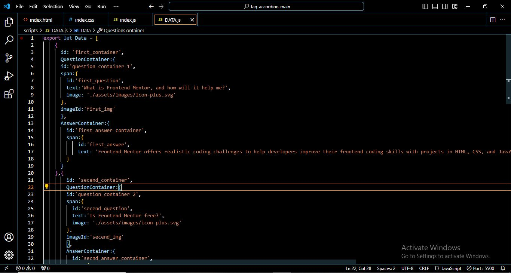
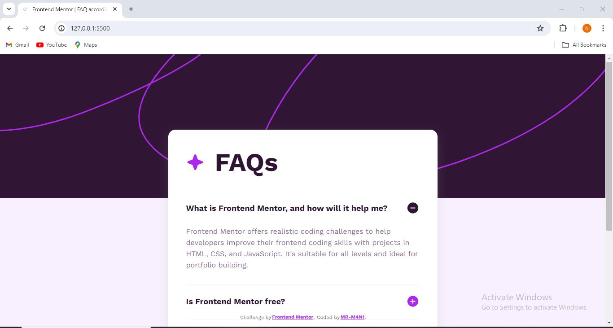

## Table of contents

- [Overview](#overview)
  - [The challenge](#the-challenge)
  - [Screenshot](#screenshot)
  - [Links](#links)
  - [Built with](#built-with)
  - [What I learned](#what-i-learned)
  - [Continued development](#continued-development)
  - [Useful resources](#useful-resources)
- [Author](#author)
- [Acknowledgments](#acknowledgments)

## Overview

- HERE YOU CAN WATCH THE  OVERVIEWS :

### The challenge

- YOU CAN SEE THE CHALLENG : [CHALLENG](https://www.frontendmentor.io/challenges/faq-accordion-wyfFdeBwBz/hu)

### Screenshot

### Links

- Solution URL: [GIT_URL]()
- Live Site URL: [GIT_LIV]()

### Built with

- Semantic HTML5 markup
- CSS custom properties
- Flexbox
- Mobile-first workflow

### What I learned

---------------------------------------

### Continued development

---------------------------------------

### Useful resources

---------------------------------------

## Author

- Frontend Mentor - [@MR_M$N!](https://www.frontendmentor.io/profile/MR-M4N1)

## Acknowledgments
 
 --------------------------------------
